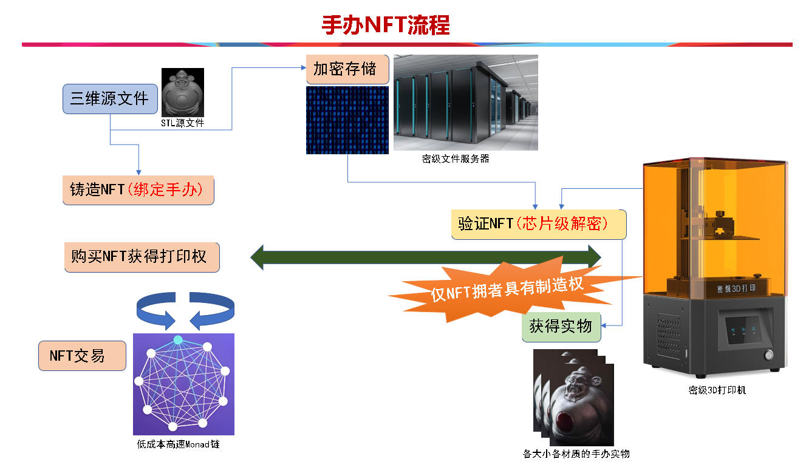

# Kit NFT 手办NFT

2021年3月，币圈企业家Sina Estavi以290万美元购买了推特CEO Jack Dorsey的首条推文NFT，但一年后再次出售时，最高出价仅1万美元，价值暴跌99%
2022年1月, 周杰伦推荐的NFT“幻象熊”，曾在一个月内暴涨至19万元，但半年后，已跌至5000元，较高点暴跌96%。
2022年1月，潘玮柏推出的“无辜猫”NFT，发行价为0.28ETH，但到2022年6月，其地板价已跌至0.014ETH，跌幅高达99.9%，几乎归零。


传统NFT有三大问题
1. 作品易被编辑和修改，
2. 无法对抗第三方使用，无法独占控制，
3. 无法跨链互操作的问题
导致其价值有限。

而本项目的手办NFT 可以解决
1. 源文件保密，且无法获取，
2. 仅拥有者可以打印出实物，
3. 可多链同时铸币

可极大增加NFT收藏价值

## 流程


## 为什么选Monad
对于一个手办NFT交易网站
1. 频繁交易需要低手续费
2. 大规模交易需要极快的速度
3. 手办圈需要一个广为人知的链做底层
Monad交易费低，并发性能高，正在被大家广为所致，以上三点Monda全具备

## 功能

- **手办NFT市场**: 选择喜欢的手办模型购买NFT
- **铸造手办NFT**: 上传NFT手办源文件铸造NFT，此NFT绑定加密3D源文件
- **打印NFT手办**: 密级打印机认证NFT，解密打印属于您的专属3D手办

## 快速开始

### 环境准备

确保你已安装：
- Node.js (v16+)
- npm 或 yarn
- MetaMask 钱包

```bash
# 安装依赖
npm install

# 安装前端依赖
cd web && npm install && cd ..
```

### 编译和部署合约

```bash
# 编译合约
npm run compile

# 部署合约
npx hardhat run scripts/deployEnhanced.js --network monadTestnet
```

部署完成后，复制合约地址并配置到前端环境变量中：

### 5. 启动前端应用

```bash
# 启动React开发服务器
npm start
```

访问 http://localhost:3000 开始

## 🛠 开发命令

### 智能合约开发
```bash
# 编译所有合约
npx hardhat compile

# 运行合约测试
npx hardhat test

# 部署基础合约 (仅Counter)
npx hardhat run scripts/deploy.js --network monadTestnet

# 部署完整游戏合约 (推荐)
npx hardhat run scripts/deployEnhanced.js --network monadTestnet

# 测试合约交互
CONTRACT_ADDRESS=0x... npx hardhat run scripts/interact.js --network monadTestnet

# 验证合约 (可选)
npx hardhat run scripts/verify.js --network monadTestnet
```

### 前端开发
```bash
# 启动开发服务器
cd web && npm start

# 构建生产版本
cd web && npm run build

# 运行前端测试
cd web && npm test
```

## 🌐 Monad 测试网信息

- **网络名称**: Monad Testnet
- **RPC URL**: https://testnet-rpc.monad.xyz
- **链ID**: 41454
- **货币符号**: MON
- **区块浏览器**: https://testnet-explorer.monad.xyz
- **水龙头**: https://faucet.monad.xyz

### MetaMask 网络配置
```json
{
  "chainId": "0xA1FE",
  "chainName": "Monad Testnet",
  "rpcUrls": ["https://testnet-rpc.monad.xyz"],
  "nativeCurrency": {
    "name": "MON",
    "symbol": "MON", 
    "decimals": 18
  },
  "blockExplorerUrls": ["https://testnet-explorer.monad.xyz"]
}
```
### 重新部署流程

如果需要重新部署合约：

```bash
# 1. 清理编译缓存
npx hardhat clean

# 2. 重新编译合约
npx hardhat compile

# 3. 重新部署
npx hardhat run scripts/deployEnhanced.js --network monadTestnet

# 4. 更新前端配置
# 将新的合约地址更新到 frontend/.env

# 5. 重启前端应用
npm run dev
```
